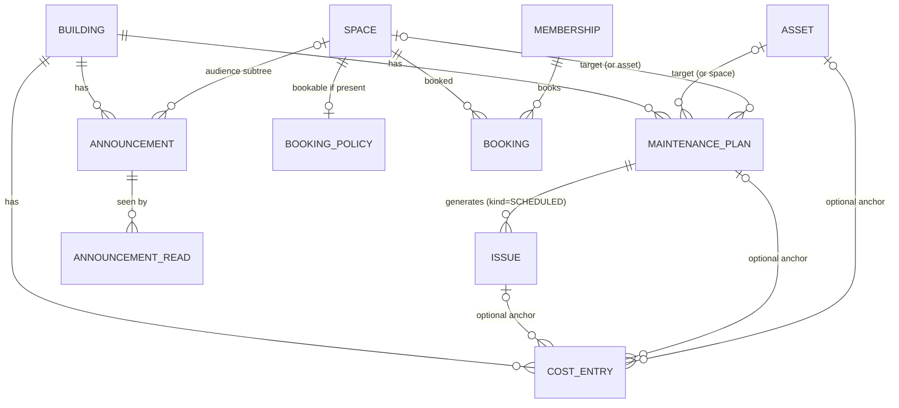

# Phase 6 — Design (not implemented)

Maintenance schedules and recurring tasks, announcements, shared-space booking and cost tracking.
This document is the design only: no code ships with it. Its job is to show how each feature sits on the
phase 1–5 model and to list the few, all additive, changes that model needs.

---

## 1. Does the phase 1–5 model block any of this?

No. Every feature reuses an existing backbone — the space tree, the permission policy table, the issue
lifecycle, notifications, `StorageService` — and adds its own tables. The audit found these adjustments, all
additive and none needing data rewrites:

| # | Gap found | Why it matters | Change (when phase 6 starts) |
|---|---|---|---|
| 1 | `building` has no **time zone** | "Every 1st Monday at 9:00", "the party room opens at 10:00" are local times; instants alone can't express them | `ALTER TABLE building ADD time_zone VARCHAR(64) NOT NULL DEFAULT 'Europe/Lisbon'` (IANA id, editable in settings) |
| 2 | `building` has no **currency** | Cost entries need a default currency | `ADD currency CHAR(3) NOT NULL DEFAULT 'EUR'` |
| 3 | `issue` requires `problem_type_id` **or** `other_text` (`ck_issue_problem`) | A scheduled maintenance task has neither — its title comes from the plan | Add `issue.kind` (`REPORTED` default \| `SCHEDULED`), `maintenance_plan_id`, `due_on`; relax the check to `kind = 'SCHEDULED' OR problem_type_id IS NOT NULL OR other_text IS NOT NULL` |
| 4 | `NotificationService` only consumes `IssueActivity` | Announcements, bookings and due tasks also notify people | Extract a generic `notify(NotificationRequest)` (recipients, building, type, title, body, link, subject id); `IssueActivity` becomes one producer of it. The `notification` table is already generic (`issue_id` nullable, free `link`) |
| 5 | Deleting spaces / archiving assets only checks assets and open issues | Plans, bookings and booking configs also hang off spaces and assets | Extend the existing guards: `SPACE_HAS_BOOKINGS` for future bookings; archiving an asset pauses its plans |
| 6 | Scheduled jobs assume one backend instance (`MembershipExpiryJob`) | Phase 6 adds two more jobs (task generation, booking reminders) | Fine on one node; when scaling out, add a DB lock (e.g. ShedLock) around `@Scheduled` methods |
| 7 | New features need new **actions** | Authorization stays "one table, one method" | Constants in `Action` + rows in `permission_policy` for both presets (table in §6). An action needs a code path that checks it anyway, so this is expected, not a smell |

Nothing else changes: `space.path` gives audiences and booking scopes, `IssueAccess`/`SpacePrivacy` give privacy,
`StorageService` + `SignedUrls` give attachments and receipts, `Versions` gives conflict detection.



---

## 2. Maintenance schedules and recurring tasks

**Goal:** "Elevator inspection every 6 months", "change the stairwell bulbs every January", "clean the garage
monthly" — generated as tasks someone must do, visible, tracked and auditable.

### Key decision: occurrences are issues
Each due occurrence is an **`Issue` with `kind = SCHEDULED`**, not a separate task table. That reuses, for free:
the lifecycle (REPORTED → … → RESOLVED), the timeline with comments and photos, notifications, the triage board,
merge, costs (§5), and the QR flow (scanning the elevator shows "inspection due Friday" next to reported
problems). The differences are small and explicit:

| | Reported issue | Scheduled task |
|---|---|---|
| Created by | a resident | the generator job |
| Title | catalog problem / "Other" text | the plan's title |
| Duplicate detection | yes | no (one per plan + due date, enforced by a unique key) |
| "Me too" | yes | no (`canMeToo = false`) |
| Urgency signal | stuck in REPORTED > 48 h | **overdue**: `due_on` passed and still open |
| Visibility | from the space (snapshot) | from the space (snapshot), usually COMMON |

### Data model
```
maintenance_plan(
  id, version, building_id,
  asset_id?  | space_id?,              -- exactly one target
  title, description?, checklist JSON?,  -- e.g. ["Test alarm", "Lubricate rails"]
  recurrence JSON,                     -- see below
  starts_on DATE, ends_on DATE?,
  lead_days INT DEFAULT 7,             -- create the task this many days before it's due
  assignee_note VARCHAR?,              -- free text: "Schindler, contract #123" (no vendor model yet)
  active BOOLEAN, paused_reason?,
  next_due_on DATE,                    -- materialized for the job
  created_by, created_at, updated_at)

issue (+ kind VARCHAR(16) DEFAULT 'REPORTED', maintenance_plan_id UUID?, due_on DATE?)
UNIQUE (maintenance_plan_id, due_on)   -- idempotent generation
```

**Recurrence** is a deliberately small, validated subset — not full RFC 5545, which is a UI and correctness trap:
`{ "every": 6, "unit": "MONTH", "dayOfMonth": 1 }`, `{ "every": 1, "unit": "WEEK", "weekdays": ["MON"] }`,
`{ "every": 1, "unit": "YEAR", "month": 1, "dayOfMonth": 15 }`, or `{ "unit": "ONCE" }`. Dates are local dates in
the building's time zone (gap #1). Month-end edge cases ("31st" in February) clamp to the last day.

### Generation
A daily job (per building, in its time zone) creates the occurrence for every active plan whose
`next_due_on - lead_days <= today`, then advances `next_due_on`. The unique key makes reruns and crashes safe.
If the previous occurrence is still open the next one is still created (inspections are legal deadlines;
skipping silently is worse than two open tasks), and the dashboard shows both as overdue.

### Lifecycle hooks
* Archiving an asset **pauses** its plans (`paused_reason = ASSET_ARCHIVED`); restoring offers to resume.
* Deleting a space with active plans → 409 `SPACE_HAS_PLANS` (same pattern as assets/issues).
* Resolving a task can require the checklist to be ticked (stored as the RESOLVED event's payload) — optional.

### Notifications
`TASK_DUE` to triagers when an occurrence is created; `TASK_OVERDUE` once when it passes `due_on`. Optionally
the plan can auto-post an **announcement** to the affected area ("Elevator out of service Fri 9–12") — see §3.

### API
| Method | Path | Action |
|---|---|---|
| GET/POST | `/buildings/{b}/maintenance-plans` | `MAINTENANCE_VIEW` / `MAINTENANCE_MANAGE` |
| GET/PUT | `/buildings/{b}/maintenance-plans/{id}` | same (PUT with `version`) |
| POST | `/buildings/{b}/maintenance-plans/{id}/pause` · `/resume` | `MAINTENANCE_MANAGE` |
| GET | `/buildings/{b}/maintenance-plans/{id}/preview?count=5` | next due dates, for the form |
| GET | `/buildings/{b}/issues?kind=SCHEDULED&status=open` | existing list endpoint + `kind` filter |

### UX
* **Web:** "Maintenance" page: plans table (target, recurrence in words — "every 6 months on the 1st", next due,
  last done), plan form with a live "next 5 dates" preview; triage board gets a *Maintenance* filter and an
  **Overdue** column highlight; dashboard gets "due this week" and "overdue" counters.
* **Mobile:** tasks appear in the triage/"Manage" list; residents see upcoming maintenance on the asset screen
  ("Next inspection: 1 Apr").

---

## 3. Announcements

**Goal:** "Water cut on floor 3 tomorrow 10–12", "General assembly on the 15th" — reach exactly the right people,
know they saw it.

### Data model
```
announcement(
  id, version, building_id, author_membership_id,
  title VARCHAR(160), body TEXT,            -- plain text + light markdown (bold, lists, links)
  audience_space_id UUID?,                  -- NULL = whole building; else this space's subtree
  audience_roles VARCHAR?                   -- optional CSV filter, e.g. "OWNER" for an owners' assembly
  pinned BOOLEAN, publish_at TIMESTAMP, expires_at TIMESTAMP?,
  created_at, updated_at, deleted_at?)
announcement_attachment(id, announcement_id, storage_key, content_type, size_bytes, name)   -- StorageService
announcement_read(announcement_id, user_id, read_at, PRIMARY KEY (announcement_id, user_id))
```

### Audience
Uses the existing materialized path, exactly like `OWN_UNIT` permissions:
* building-wide → every active member;
* subtree `S` → members whose **unit** lies within `S` (`unit.path LIKE S.path || '%'`), plus everyone holding
  `ANNOUNCEMENT_POST` (so managers see what was posted);
* `audience_roles` narrows further (owners-only assembly convocations).
Expired or revoked memberships never match (same `isActiveAt` rule as everything else).

### Behaviour
* Scheduled publishing (`publish_at` in the future) — the same daily/minutely job publishes and notifies.
* **Notifications:** `ANNOUNCEMENT` to the audience (push + in-app), link `/buildings/{b}/announcements/{id}`.
* **Read receipts:** opening it records `announcement_read`; authors see "seen by 34 / 52" (count only, no list,
  for privacy — a list could be an owners-only option later).
* Editing after publishing keeps the id, records `updated_at` and shows "edited"; no re-notification unless the
  author ticks "notify again". Soft delete.
* Maintenance plans (§2) can create announcements for their target's subtree automatically.

### API
| Method | Path | Action |
|---|---|---|
| GET | `/buildings/{b}/announcements?includeExpired=` | member (filtered to their audience) |
| POST / PUT / DELETE | `/buildings/{b}/announcements[/{id}]` | `ANNOUNCEMENT_POST` (author or same rights) |
| POST | `/buildings/{b}/announcements/{id}/read` | member in audience |
| POST | `/buildings/{b}/announcements/{id}/attachments` | `ANNOUNCEMENT_POST` |

### UX
* **Web:** "Announcements" page with composer (audience picker = the existing space tree + role chips; "who will
  receive this: 12 people" preview), pinned first.
* **Mobile:** banner for unread pinned announcements on the building screen; list; push opens it.

---

## 4. Shared-space booking

**Goal:** book the party room, the BBQ, the guest parking spot — no double bookings, fair limits, house rules.

### Data model
```
booking_policy(                              -- presence makes a space bookable (typically a COMMON_AREA)
  space_id PK, version,
  enabled BOOLEAN,
  slot_minutes INT,                          -- granularity, e.g. 30
  min_minutes INT, max_minutes INT,
  opening_hours JSON,                        -- per weekday, local time: {"MON":[["10:00","22:00"]], …}
  advance_days INT,                          -- how far ahead one may book
  max_active_per_unit INT?,                  -- fairness: e.g. 2 future bookings per unit
  requires_approval BOOLEAN,
  cancel_cutoff_hours INT,                   -- residents can't cancel later than this
  rules_text TEXT?)                          -- house rules shown before confirming

booking(
  id, version, building_id, space_id,
  membership_id, unit_space_id?,             -- unit snapshot for per-unit limits
  starts_at TIMESTAMP, ends_at TIMESTAMP,    -- instants; UI renders in the building's time zone
  status VARCHAR(16),                        -- PENDING | CONFIRMED | REJECTED | CANCELLED
  note VARCHAR?, decided_by?, decided_at?, cancelled_by?, cancelled_at?,
  created_at)
```

### Correctness
* **No overlaps:** creating or approving a booking takes a row lock on the space's `booking_policy`
  (`SELECT … FOR UPDATE`, the same pattern as issue numbering and invitation accepts), then checks overlap
  against PENDING + CONFIRMED bookings. Portable to H2 and PostgreSQL; on PostgreSQL an exclusion constraint on
  `tstzrange(starts_at, ends_at)` can be added later as a second line of defence.
* Validation in the building's time zone: inside opening hours, aligned to `slot_minutes`, within
  min/max duration and `advance_days`, not in the past, per-unit limit.
* **Memberships:** expired/revoked members can't book (permission check); the existing expiry job also
  **cancels their future bookings** and notifies admins.
* Spaces with future bookings can't be deleted (`SPACE_HAS_BOOKINGS`); disabling a policy keeps existing
  bookings and offers "cancel and notify all".

### Notifications
`BOOKING_REQUESTED` → members with `BOOKING_MANAGE` (when approval is required); `BOOKING_CONFIRMED` / `BOOKING_REJECTED` / `BOOKING_CANCELLED` → the
booker; optional reminder 24 h before (job).

### API
| Method | Path | Action |
|---|---|---|
| GET | `/buildings/{b}/bookable-spaces` | member |
| GET/PUT | `/buildings/{b}/spaces/{s}/booking-policy` | member / `BOOKING_MANAGE` |
| GET | `/buildings/{b}/spaces/{s}/availability?from=&to=` | member — free/busy slots, no names |
| GET | `/buildings/{b}/bookings?mine=&spaceId=&from=&to=` | member (others' bookings show as "booked", names only to `BOOKING_MANAGE`) |
| POST | `/buildings/{b}/bookings` | `BOOKING_CREATE` |
| POST | `/buildings/{b}/bookings/{id}/approve` · `/reject` | `BOOKING_MANAGE` |
| POST | `/buildings/{b}/bookings/{id}/cancel` | booker (before cutoff) or `BOOKING_MANAGE` |
| GET | `/me/bookings.ics?token=` | signed calendar feed (reuses `SignedUrls`) |

### UX
* **Mobile:** "Book a space" → pick space → week strip with free slots → tap start/end → rules → confirm.
* **Web:** calendar per space; admin approvals queue; policy editor with opening-hours grid.

---

## 5. Cost tracking

**Goal:** know what the building spends, on what, and why — per issue, per asset, per month — with receipts.
This is **tracking, not billing**: splitting costs across units by quota (*permilagem*) and issuing charges is a
separate, much larger domain (see open question 4).

### Data model
```
cost_entry(
  id, version, building_id,
  amount NUMERIC(12,2), currency CHAR(3),      -- BigDecimal in Java, never double; default building.currency
  incurred_on DATE,
  category VARCHAR(32),                        -- REPAIR | MAINTENANCE | CLEANING | UTILITIES | INSURANCE | OTHER
  description VARCHAR(500), vendor VARCHAR(160)?,
  issue_id?, maintenance_plan_id?, asset_id?, space_id?,   -- optional anchors (several allowed)
  receipt_storage_key?, receipt_content_type?,              -- StorageService, served via SignedUrls
  created_by, created_at, updated_at, deleted_at?)
```
Categories start as an enum; if buildings need their own, they become reference rows like asset types.

### Rules
* Costs inherit **privacy** from their anchor: a cost on a private, unshared issue is visible only to whoever can
  see that issue *and* holds `COST_VIEW`.
* Anchoring a cost to an issue derives its asset/space automatically, so "total spent on the elevator this year"
  includes repair costs logged on its issues and on its maintenance tasks.
* Edits with `version`; soft delete with reason (audit trail). Receipts are images or PDF (magic-byte checked,
  as photos are).

### Reports
| Endpoint | Shows |
|---|---|
| `GET /buildings/{b}/costs?from=&to=&category=&assetId=&issueId=` | entries, paged |
| `GET /buildings/{b}/costs/summary?from=&to=&groupBy=month\|category\|asset\|space` | totals for charts |
| `GET /buildings/{b}/costs/export.csv?from=&to=` | for the accountant |
| Issue detail / asset detail | "Costs: €340 (3 entries)" |

### API / permissions
`COST_VIEW` for lists and reports, `COST_MANAGE` to create/edit/delete (§6).

### UX
* **Web:** Costs page with filters, monthly bar chart, category breakdown, asset "cost of ownership"; add-cost
  dialog from an issue, a task or the costs page (amount, date, category, vendor, receipt photo).
* **Mobile:** "Add cost + photo of the receipt" from an issue for managers on site; read-only totals.

---

## 6. Permissions: new actions and preset rows

Same model as phases 1–5: new `Action` constants, rows per preset, one `PermissionService.can` call.

| Action | MANAGED | OPEN |
|---|---|---|
| `MAINTENANCE_VIEW` | all roles | all roles |
| `MAINTENANCE_MANAGE` | ADMIN, MANAGER | ADMIN, MANAGER, OWNER |
| `ANNOUNCEMENT_POST` | ADMIN, MANAGER | ADMIN, MANAGER, OWNER |
| `BOOKING_CREATE` | all roles | all roles |
| `BOOKING_MANAGE` | ADMIN, MANAGER | ADMIN, MANAGER, OWNER |
| `COST_VIEW` | ADMIN, MANAGER, OWNER | all roles |
| `COST_MANAGE` | ADMIN, MANAGER | ADMIN, MANAGER, OWNER |

Owners seeing costs in Managed mode reflects that owners pay for the building; tenants don't by default — one
row to change if a building disagrees. A building wanting, say, "tenants may book but need approval" changes
`requires_approval` on the space, not code.

---

## 7. Migrations (sketch, in order)

1. `V8__building_locale.sql` — `building.time_zone`, `building.currency` (gaps #1–2).
2. `V9__maintenance.sql` — `maintenance_plan`; `issue.kind`, `maintenance_plan_id`, `due_on`; relax
   `ck_issue_problem`; unique `(maintenance_plan_id, due_on)`; policy rows.
3. `V10__announcements.sql` — `announcement`, `announcement_attachment`, `announcement_read`; policy rows.
4. `V11__bookings.sql` — `booking_policy`, `booking`; indexes `(space_id, starts_at)`; policy rows.
5. `V12__costs.sql` — `cost_entry`; indexes `(building_id, incurred_on)`, `(issue_id)`, `(asset_id)`; policy rows.

All additive; existing rows get defaults (`issue.kind = 'REPORTED'`). No backfills.

## 8. Suggested order

1. **Announcements** — smallest, immediately useful, and it forces the notification generalization (gap #4).
2. **Maintenance** — biggest value per line of code because occurrences are issues.
3. **Costs** — anchors on issues and plans, which then exist.
4. **Booking** — most rules (time zones, opening hours, concurrency, fairness), least coupled to the rest.

## 9. Open questions for you

1. **Maintenance tasks as issues** (recommended above) vs. a separate task list that never mixes with resident
   reports in the triage board?
2. **Booking approvals:** default on or off for new bookable spaces? Any **paid** bookings or deposits? (Payments
   would be a new integration.)
3. **Announcements:** should some (e.g. assembly convocations) require explicit **acknowledgement**, not just
   "seen"? Is "seen by N" enough or do admins need the list of names?
4. **Costs:** tracking only, or should the app eventually **split costs by unit quota** (*permilagem*) and produce
   per-unit statements? The latter adds unit shares to the space tree, accounting periods and documents.
5. **Default time zone and currency** for new buildings — Europe/Lisbon and EUR, or pick from the address?
