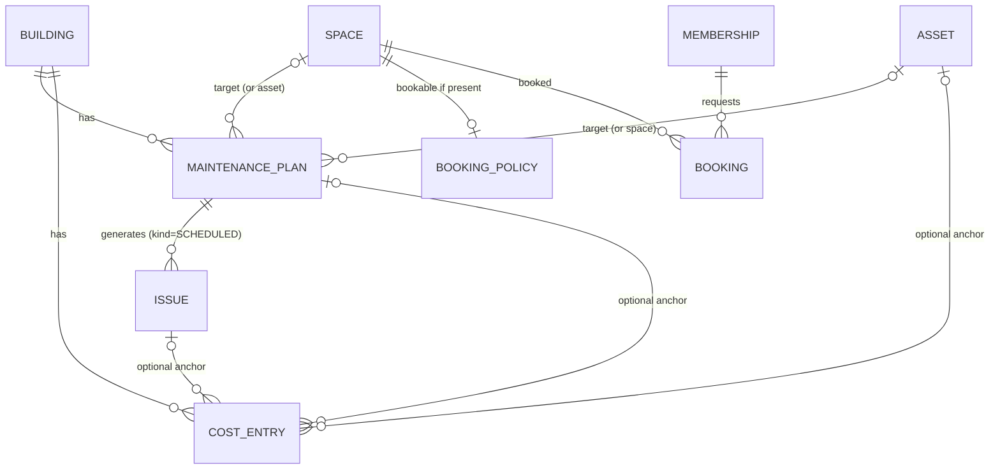

# Phase 6 — Design (not implemented)

Maintenance schedules and recurring tasks, shared-space booking and cost tracking.
This document is the design only: no code ships with it. Its job is to show how each feature sits on the
phase 1–5 model and to list the few, all additive, changes that model needs.

## Decisions (2026-10-06)

| # | Question | Decision |
|---|---|---|
| 1 | Maintenance tasks: issues or a separate list? | **Issues** (`kind = SCHEDULED`) — §2 |
| 2 | Booking approvals, payments? | **Every booking is reviewed by an admin** (`BOOKING_MANAGE`) before it's confirmed; **no payments or deposits** — §3 |
| 3 | Announcements | **Dropped** from scope. Nothing below depends on them |
| 4 | Costs: tracking or per-unit splitting? | **Tracking only** — no quota (*permilagem*) splitting or per-unit statements — §4 |
| 5 | Currency and time zone | **EUR by default, future-proof**: every amount carries its own ISO 4217 currency, nothing assumes EUR — §4. Time zone defaults to Europe/Lisbon, editable per building |

---

## 1. Does the phase 1–5 model block any of this?

No. Every feature reuses an existing backbone — the space tree, the permission policy table, the issue
lifecycle, notifications, `StorageService` — and adds its own tables. The audit found these adjustments, all
additive and none needing data rewrites:

| # | Gap found | Why it matters | Change (when phase 6 starts) |
|---|---|---|---|
| 1 | `building` has no **time zone** | "Every 1st Monday", "the party room opens at 10:00" are local times; instants alone can't express them | `ALTER TABLE building ADD time_zone VARCHAR(64) NOT NULL DEFAULT 'Europe/Lisbon'` (IANA id, editable in settings) |
| 2 | `building` has no **currency** | New cost entries need a default | `ADD currency CHAR(3) NOT NULL DEFAULT 'EUR'` — only a default; amounts store their own currency (§4) |
| 3 | `issue` requires `problem_type_id` **or** `other_text` (`ck_issue_problem`) | A scheduled maintenance task has neither — its title comes from the plan | Add `issue.kind` (`REPORTED` default \| `SCHEDULED`), `maintenance_plan_id`, `due_on`; relax the check to `kind = 'SCHEDULED' OR problem_type_id IS NOT NULL OR other_text IS NOT NULL` |
| 4 | `NotificationService` only consumes `IssueActivity` | Booking requests/decisions and due tasks also notify people | Extract a generic `notify(NotificationRequest)` (recipients, building, type, title, body, link, subject id); `IssueActivity` becomes one producer of it. The `notification` table is already generic (`issue_id` nullable, free `link`) |
| 5 | Deleting spaces / archiving assets only checks assets and open issues | Plans, bookings and booking policies also hang off spaces and assets | Extend the existing guards: `SPACE_HAS_BOOKINGS`, `SPACE_HAS_PLANS`; archiving an asset pauses its plans |
| 6 | Scheduled jobs assume one backend instance (`MembershipExpiryJob`) | Phase 6 adds task generation and booking reminders | Fine on one node; when scaling out, add a DB lock (e.g. ShedLock) around `@Scheduled` methods |
| 7 | New features need new **actions** | Authorization stays "one table, one method" | Constants in `Action` + rows in `permission_policy` for both presets (table in §5) |

Nothing else changes: `space.path` gives booking scopes, `IssueAccess`/`SpacePrivacy` give privacy,
`StorageService` + `SignedUrls` give receipts, `Versions` gives conflict detection.



---

## 2. Maintenance schedules and recurring tasks

**Goal:** "Elevator inspection every 6 months", "change the stairwell bulbs every January", "clean the garage
monthly" — generated as tasks someone must do, visible, tracked and auditable.

### Occurrences are issues *(decided)*
Each due occurrence is an **`Issue` with `kind = SCHEDULED`**, not a separate task table. That reuses, for free:
the lifecycle (REPORTED → … → RESOLVED), the timeline with comments and photos, notifications, the triage board,
merge, costs (§4), and the QR flow (scanning the elevator shows "inspection due Friday" next to reported
problems). The differences are small and explicit:

| | Reported issue | Scheduled task |
|---|---|---|
| Created by | a resident | the generator job |
| Title | catalog problem / "Other" text | the plan's title |
| Duplicate detection | yes | no (one per plan + due date, enforced by a unique key) |
| "Me too" | yes | no (`canMeToo = false`) |
| Urgency signal | stuck in REPORTED > 48 h | **overdue**: `due_on` passed and still open |
| Visibility | from the space (snapshot) | from the space (snapshot), usually COMMON |

### Data model
```
maintenance_plan(
  id, version, building_id,
  asset_id?  | space_id?,              -- exactly one target
  title, description?, checklist JSON?,  -- e.g. ["Test alarm", "Lubricate rails"]
  recurrence JSON,                     -- see below
  starts_on DATE, ends_on DATE?,
  lead_days INT DEFAULT 7,             -- create the task this many days before it's due
  assignee_note VARCHAR?,              -- free text: "Schindler, contract #123" (no vendor model yet)
  active BOOLEAN, paused_reason?,
  next_due_on DATE,                    -- materialized for the job
  created_by, created_at, updated_at)

issue (+ kind VARCHAR(16) DEFAULT 'REPORTED', maintenance_plan_id UUID?, due_on DATE?)
UNIQUE (maintenance_plan_id, due_on)   -- idempotent generation
```

**Recurrence** is a deliberately small, validated subset — not full RFC 5545, which is a UI and correctness trap:
`{ "every": 6, "unit": "MONTH", "dayOfMonth": 1 }`, `{ "every": 1, "unit": "WEEK", "weekdays": ["MON"] }`,
`{ "every": 1, "unit": "YEAR", "month": 1, "dayOfMonth": 15 }`, or `{ "unit": "ONCE" }`. Dates are local dates in
the building's time zone (gap #1). Month-end edge cases ("31st" in February) clamp to the last day.

### Generation
A daily job (per building, in its time zone) creates the occurrence for every active plan whose
`next_due_on - lead_days <= today`, then advances `next_due_on`. The unique key makes reruns and crashes safe.
If the previous occurrence is still open the next one is still created (inspections are legal deadlines;
skipping silently is worse than two open tasks), and the dashboard shows both as overdue.

### Lifecycle hooks
* Archiving an asset **pauses** its plans (`paused_reason = ASSET_ARCHIVED`); restoring offers to resume.
* Deleting a space with active plans → 409 `SPACE_HAS_PLANS` (same pattern as assets/issues).
* Resolving a task can require the checklist to be ticked (stored as the RESOLVED event's payload) — optional.

### Notifications
`TASK_DUE` to triagers when an occurrence is created; `TASK_OVERDUE` once when it passes `due_on`.

### API
| Method | Path | Action |
|---|---|---|
| GET/POST | `/buildings/{b}/maintenance-plans` | `MAINTENANCE_VIEW` / `MAINTENANCE_MANAGE` |
| GET/PUT | `/buildings/{b}/maintenance-plans/{id}` | same (PUT with `version`) |
| POST | `/buildings/{b}/maintenance-plans/{id}/pause` · `/resume` | `MAINTENANCE_MANAGE` |
| GET | `/buildings/{b}/maintenance-plans/{id}/preview?count=5` | next due dates, for the form |
| GET | `/buildings/{b}/issues?kind=SCHEDULED&status=open` | existing list endpoint + `kind` filter |

### UX
* **Web:** "Maintenance" page: plans table (target, recurrence in words — "every 6 months on the 1st", next due,
  last done), plan form with a live "next 5 dates" preview; triage board gets a *Maintenance* filter and an
  **Overdue** highlight; dashboard gets "due this week" and "overdue" counters.
* **Mobile:** tasks appear in the triage/"Manage" list; residents see upcoming maintenance on the asset screen
  ("Next inspection: 1 Apr").

---

## 3. Shared-space booking

**Goal:** book the party room, the BBQ, the guest parking spot — no double bookings, fair limits, house rules,
and **an admin reviews every request** *(decided)*. No payments or deposits *(decided)*.

### Data model
```
booking_policy(                              -- presence makes a space bookable (typically a COMMON_AREA)
  space_id PK, version,
  enabled BOOLEAN,
  slot_minutes INT,                          -- granularity, e.g. 30
  min_minutes INT, max_minutes INT,
  opening_hours JSON,                        -- per weekday, local time: {"MON":[["10:00","22:00"]], …}
  advance_days INT,                          -- how far ahead one may book
  max_active_per_unit INT?,                  -- fairness: e.g. 2 pending/confirmed future bookings per unit
  cancel_cutoff_hours INT,                   -- residents can't cancel a confirmed booking later than this
  rules_text TEXT?)                          -- house rules shown before requesting

booking(
  id, version, building_id, space_id,
  membership_id, unit_space_id?,             -- unit snapshot for per-unit limits
  starts_at TIMESTAMP, ends_at TIMESTAMP,    -- instants; UI renders in the building's time zone
  status VARCHAR(16),                        -- PENDING | CONFIRMED | REJECTED | CANCELLED
  note VARCHAR?,                             -- requester's note ("birthday, ~20 people")
  decision_note VARCHAR?,                    -- admin's reason, shown to the requester on rejection
  decided_by?, decided_at?, cancelled_by?, cancelled_at?,
  created_at)
```
There is no `requires_approval` switch: approval is always required. Payment fields are deliberately absent;
adding paid bookings later would be a separate `booking_charge` table plus a payment-provider integration, without
touching `booking`.

### Flow
1. A member requests a slot → **PENDING**. The slot is held: other requests for an overlapping time are refused,
   so the admin never has to choose between two people for the same evening.
2. An admin (`BOOKING_MANAGE`) **approves** → CONFIRMED, or **rejects** with an optional reason → REJECTED (slot
   freed).
3. Pending requests not decided before their start time expire automatically (job) → REJECTED with reason
   "Not reviewed in time", and the admins' queue shows how old each request is.
4. The requester can withdraw a PENDING request anytime and cancel a CONFIRMED one until `cancel_cutoff_hours`;
   admins can cancel anything, with a reason.

### Correctness
* **No overlaps:** requesting or approving takes a row lock on the space's `booking_policy`
  (`SELECT … FOR UPDATE`, the same pattern as issue numbering and invitation accepts), then checks overlap
  against PENDING + CONFIRMED bookings. Portable to H2 and PostgreSQL; on PostgreSQL an exclusion constraint on
  `tstzrange(starts_at, ends_at)` can be added later as a second line of defence.
* Validation in the building's time zone: inside opening hours, aligned to `slot_minutes`, within
  min/max duration and `advance_days`, not in the past, per-unit limit.
* **Memberships:** expired/revoked members can't request (permission check); the existing expiry job also
  **cancels their pending and future bookings** and notifies admins.
* Spaces with future bookings can't be deleted (`SPACE_HAS_BOOKINGS`); disabling a policy keeps existing
  bookings and offers "cancel and notify all".

### Notifications
`BOOKING_REQUESTED` → members with `BOOKING_MANAGE`; `BOOKING_CONFIRMED` / `BOOKING_REJECTED` (with the reason) /
`BOOKING_CANCELLED` → the requester; optional reminder 24 h before a confirmed booking (job).

### API
| Method | Path | Action |
|---|---|---|
| GET | `/buildings/{b}/bookable-spaces` | member |
| GET/PUT | `/buildings/{b}/spaces/{s}/booking-policy` | member / `BOOKING_MANAGE` |
| GET | `/buildings/{b}/spaces/{s}/availability?from=&to=` | member — free/held/booked slots, no names |
| GET | `/buildings/{b}/bookings?mine=&spaceId=&status=&from=&to=` | member (others' bookings show only as "booked", names only to `BOOKING_MANAGE`) |
| POST | `/buildings/{b}/bookings` | `BOOKING_CREATE` → PENDING |
| POST | `/buildings/{b}/bookings/{id}/approve` · `/reject` | `BOOKING_MANAGE` |
| POST | `/buildings/{b}/bookings/{id}/cancel` | requester (PENDING anytime, CONFIRMED before cutoff) or `BOOKING_MANAGE` |
| GET | `/me/bookings.ics?token=` | signed calendar feed of confirmed bookings (reuses `SignedUrls`) |

### UX
* **Mobile:** "Book a space" → pick space → week strip with free slots → tap start/end → rules → "Request" →
  "Waiting for approval" with status in *My bookings*; push when decided.
* **Web:** calendar per space (pending shown hatched); **approvals queue** with one-click approve/reject-with-reason;
  policy editor with an opening-hours grid.

---

## 4. Cost tracking

**Goal:** know what the building spends, on what, and why — per issue, per asset, per month — with receipts.
**Tracking only** *(decided)*: no splitting by unit quota (*permilagem*), no per-unit statements or charges.

### Money, future-proof *(decided)*
* Every amount is stored **with its own currency**: `amount NUMERIC(19,4)` + `currency CHAR(3)` (ISO 4217).
  `building.currency` (default **EUR**) only pre-fills the form.
* In Java a small `Money(BigDecimal amount, Currency currency)` value type; never `double`. The amount's scale is
  validated against the currency's minor units (`Currency.getDefaultFractionDigits()`: 2 for EUR, 0 for JPY, 3 for
  BHD), so new currencies need no code.
* **No implicit conversion:** totals and reports are always **grouped by currency** ("€1,240.00 · £85.00"). If a
  building ever mixes currencies, an exchange-rate table can be added later without changing stored entries.
* The API carries amounts as **decimal strings** (`"amount": "120.50", "currency": "EUR"`) so JavaScript clients
  never round through floating point; clients format them with `Intl.NumberFormat` in the user's locale.

### Data model
```
cost_entry(
  id, version, building_id,
  amount NUMERIC(19,4), currency CHAR(3),
  incurred_on DATE,
  category VARCHAR(32),                        -- REPAIR | MAINTENANCE | CLEANING | UTILITIES | INSURANCE | OTHER
  description VARCHAR(500), vendor VARCHAR(160)?,
  issue_id?, maintenance_plan_id?, asset_id?, space_id?,   -- optional anchors (several allowed)
  receipt_storage_key?, receipt_content_type?,              -- StorageService, served via SignedUrls
  created_by, created_at, updated_at, deleted_at?, delete_reason?)
```
Categories start as an enum; if buildings need their own, they become reference rows like asset types.

### Rules
* Costs inherit **privacy** from their anchor: a cost on a private, unshared issue is visible only to whoever can
  see that issue *and* holds `COST_VIEW`.
* Anchoring a cost to an issue derives its asset/space automatically, so "total spent on the elevator this year"
  includes repair costs logged on its issues and on its maintenance tasks.
* Edits with `version`; soft delete with reason (audit trail). Receipts are images or PDF (magic-byte checked,
  as photos are).

### Reports
| Endpoint | Shows |
|---|---|
| `GET /buildings/{b}/costs?from=&to=&category=&assetId=&issueId=` | entries, paged |
| `GET /buildings/{b}/costs/summary?from=&to=&groupBy=month\|category\|asset\|space` | totals per group **and currency** |
| `GET /buildings/{b}/costs/export.csv?from=&to=` | for the accountant (amount, currency, date, category, anchors) |
| Issue detail / asset detail | "Costs: €340.00 (3 entries)" |

### API / permissions
`COST_VIEW` for lists and reports, `COST_MANAGE` to create/edit/delete (§5).

### UX
* **Web:** Costs page with filters, monthly bar chart, category breakdown, asset "cost of ownership"; add-cost
  dialog from an issue, a task or the costs page (amount, currency pre-filled from the building, date, category,
  vendor, receipt photo).
* **Mobile:** "Add cost + photo of the receipt" from an issue for managers on site; read-only totals.

---

## 5. Permissions: new actions and preset rows

Same model as phases 1–5: new `Action` constants, rows per preset, one `PermissionService.can` call.

| Action | MANAGED | OPEN |
|---|---|---|
| `MAINTENANCE_VIEW` | all roles | all roles |
| `MAINTENANCE_MANAGE` | ADMIN, MANAGER | ADMIN, MANAGER, OWNER |
| `BOOKING_CREATE` | all roles | all roles |
| `BOOKING_MANAGE` (approve/reject, policies) | ADMIN, MANAGER | ADMIN, MANAGER |
| `COST_VIEW` | ADMIN, MANAGER, OWNER | all roles |
| `COST_MANAGE` | ADMIN, MANAGER | ADMIN, MANAGER, OWNER |

`BOOKING_MANAGE` stays with admins and managers in both presets, matching "an admin reviews every request".
Owners seeing costs in Managed mode reflects that owners pay for the building; tenants don't by default — one
row to change if a building disagrees.

---

## 6. Migrations (sketch, in order)

1. `V8__building_locale.sql` — `building.time_zone` (default `Europe/Lisbon`), `building.currency` (default `EUR`).
2. `V9__maintenance.sql` — `maintenance_plan`; `issue.kind`, `maintenance_plan_id`, `due_on`; relax
   `ck_issue_problem`; unique `(maintenance_plan_id, due_on)`; policy rows.
3. `V10__costs.sql` — `cost_entry`; indexes `(building_id, incurred_on)`, `(issue_id)`, `(asset_id)`; policy rows.
4. `V11__bookings.sql` — `booking_policy`, `booking`; index `(space_id, starts_at)`; policy rows.

All additive; existing rows get defaults (`issue.kind = 'REPORTED'`). No backfills.

## 7. Suggested order

1. **Maintenance** — biggest value per line of code because occurrences are issues; it also introduces the generic
   notification API (gap #4) and the building time zone that booking needs later.
2. **Costs** — anchors on issues and plans, which then exist; introduces `Money`.
3. **Booking** — most rules (time zones, opening hours, concurrency, approvals), least coupled to the rest.

## 8. Remaining open points

These don't block the design; decide them when the feature is built.

* **Pending requests that nobody reviews** expire at their start time (above). Should admins also get a reminder,
  e.g. when a request has waited 48 hours?
* **Cost visibility for owners** in Managed mode is on by default (§5). Confirm, or limit to admins and managers.
